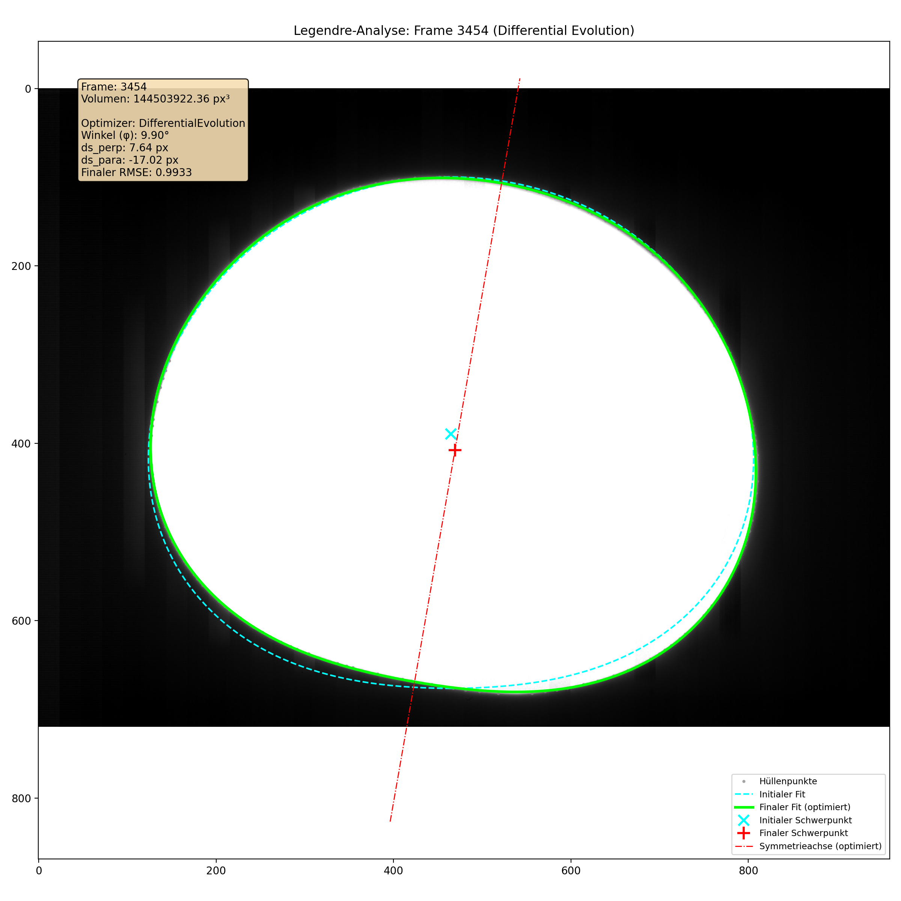

    
# High-Precision Volume Measurement of Levitated Droplets
[](https://www.gnu.org/licenses/gpl-3.0)

A Python-based analysis pipeline for determining the volume of levitated, high-temperature melts from high-speed video recordings. This tool implements a robust computer vision and numerical optimization workflow to achieve high-precision measurements under challenging experimental conditions.


*Example of the final analysis output for a single frame, showing the detected contour, initial fit, and the globally optimized Legendre model.*

## Overview

This project provides a Python-based pipeline for calculating the 3D volume of a **rotationally symmetric deformed sphere** from its 2D video silhouette. It offers a complete, open-source solution for analyzing video data where direct 3D measurement is impractical or impossible.

The core workflow is as follows:
1.  **Extracts** the object's 2D contour from each video frame.
2.  **Models** the shape mathematically using a series of Legendre polynomials.
3.  **Reconstructs** the 3D volume by integrating the 2D profile around its axis of symmetry.

While the tool is broadly applicable, it was originally designed to solve a challenging problem in materials science: measuring the density of ceramic melts at temperatures over 2000°C. The robustness of this tool comes from its development for these extreme experimental conditions.

## Broader Applications

The fundamental assumption of this tool is **rotational symmetry**. Any object that meets this geometric prerequisite can be analyzed, including:

-   **Materials Science:** Calculating the volume of a levitated droplet (Aero-acoustic, Electrostatic, or Magnetic Levitation).
-   **Fluid Dynamics:** Analyzing the shape and volume of falling raindrops or rising bubbles.
-   **Biology & Biophysics:** Measuring the volume of single cells, vesicles, or eggs under a microscope, provided they are approximately spherical.
-   **Quality Control:** Automated inspection and volume verification of rotationally symmetric manufactured parts.

## Features

- **Video Processing:** Directly handles `.cine` video files from high-speed Phantom cameras.
- **Robust Contour Detection:** Uses a dynamic Otsu threshold, Canny edge detection, and a Convex Hull algorithm to reliably extract the droplet's contour.
- **Advanced Mathematical Modeling:** Describes the shape using a series of Legendre polynomials.
- **Global Optimization:** Implements a **Differential Evolution** algorithm to simultaneously find the optimal tilt angle and center position.
- **High Performance:** Utilizes Python's `multiprocessing` library to analyze frames in parallel.
- **Detailed Visual Output:** An optional debug mode generates detailed plots for each step of the analysis.

## Installation

1.  **Download the Code:**
    Clone or download the repository to your local machine.
    ```bash
    git clone https://github.com/ Birkenrinde/rotationally-symmetric-volume-analyzer.git
    cd rotationally-symmetric-volume-analyzer
    ```

2.  **Set up a Virtual Environment:**
    It is highly recommended to use a virtual environment.
    *   **Windows:**
        ```bash
        python -m venv venv
        .\venv\Scripts\activate
        ```
    *   **macOS / Linux:**
        ```bash
        python3 -m venv venv
        source venv/bin/activate
        ```

3.  **Install Dependencies:**
    Install all required packages from the `requirements.txt` file.
    ```bash
    pip install -r requirements.txt
    ```

## Usage

Configuration and execution are straightforward.

#### 1. Configure the Analysis

Open the file `volume_analysis/config.py` in a text editor. All analysis parameters are set here.

**At a minimum, you must set the input and output paths:**
```python
# Path to the video file you want to analyze
INPUT_PATH: str = "path/to/your/file.cine"

# Directory where the results will be saved
OUTPUT_BASE_DIR: str = "analysis_results"
```
  

You can further customize the analysis by adjusting other parameters in the file, such as frame ranges, debug mode, and model settings.
2. Run the Analysis

Execute the main.py script from the project's root directory using the -m flag (which ensures imports work correctly).
```Bash
python -m Dichte_Analyse.main
```
  

The script will print its progress to the console and save the results in the specified output directory.

## The Analysis Workflow

The pipeline processes each video frame in a multi-step sequence:
1. Preprocessing & Contour Extraction

    The frame is loaded and converted to an 8-bit grayscale image.

    An optimal threshold is determined using Otsu's method to separate the object from the background.

    The Canny edge detector is applied to find precise edge pixels.

    The Convex Hull of these pixels is calculated to create a clean, continuous contour.

2. Mathematical Modeling

    The 2D contour of the object is assumed to be rotationally symmetric.

    Its shape is modeled as a weighted sum of Legendre polynomials Pₙ(cosθ), where r(θ) is the radius at a given angle θ.

3. Global Optimization

    A direct fit is often inaccurate because the object's true center and symmetry axis are unknown.

    The Differential Evolution algorithm finds the optimal (x, y) center and tilt angle φ that minimize the error between the model and the contour points.

4. Volume Calculation

    With the optimal coefficients, the 3D volume is calculated by integrating the 2D shape around its axis of symmetry.

## License

This project is licensed under the GNU General Public License v3.0. See the LICENSE file for details.

This means you are free to use, modify, and distribute this software for any purpose (personal, academic, or commercial). However, any derivative work you distribute must also be licensed under the GPLv3, ensuring that the work remains open source.

## Acknowledgments

The core methodology implemented in this project was developed by Finn Herold for his bachelor's thesis at the Institute of Mineral Engineering / Institut für Gesteinshüttenkunde (GHI) - RWTH Aachen University .

This work was inspired by and builds upon the foundational paper on machine vision for volume measurement by Bradshaw *et al.*:

> R. C. Bradshaw, D. P. Schmidt, J. R. Rogers, K. F. Kelton, and R. W. Hyers, “Machine vision for high-precision volume measurement applied to levitated containerless material processing,” *Review of Scientific Instruments*, vol. 76, no. 12, 2005. [https://doi.org/10.1063/1.2140490](https://doi.org/10.1063/1.2140490)

This repository contains a further developed and refactored version of the original bachelor thisis code, adapted for broader use and public release.
